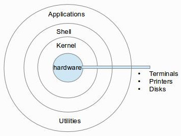

# 리눅스의 아키텍처 
1. 쉘과 커널
2. 쉘 - bash 와 zsh(z-shell)

## 쉘과 커널

* 커널 : 운영 체제의 핵심 부분이며 CPU, 메모리 및 주변 장치를 관리
  *  Linux 커널은 C 로 작성됨.
  *  운영 체제의 모든 주요 활동을 담당
    *  장치와 소프트웨어 간의 통신을 관리 
    *  시스템 리소스 (예 : CPU 시간, 메모리, 네트워크…)를 관리
    *  프로그래머가 하드웨어를 조작 할 수있는 인터페이스를 제공

* 쉘 : 사용자 인터페이스 역할로, 사용자 명령을 해석하고 응용 프로그램을 실행시킴
  * 보통의 사용자는 일반적으로 터미널 에뮬레이터를 사용하여 Linux 셸과 상호 작용
  * 서버 시스템에서는 일반적으로 직렬 하드웨어 연결 또는 네트워킹 세션을 통한 직접 작업

[참고](https://srinisbook.com/linux-tutorial/introduction/)

## bash 와 zsh(z-shell)

[참고](https://dev.to/jasmin/a-brief-difference-between-zsh-and-bash-5ebp)
